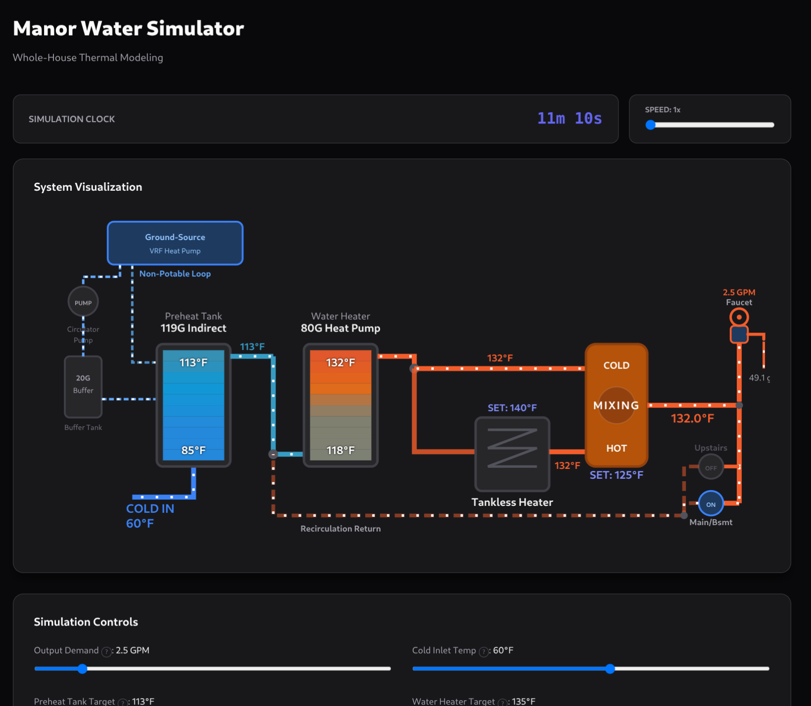

# Joyner Manor Water Simulator

**[Try the live simulator](https://asjoyner.github.io/manor-water-simulator/)**

## Overview

This is an interactive simulator for the hot water system at Joyner Manor.  It centers on a real-time animated SVG plumbing diagram, and models the complete thermal behavior of the series-hybrid domestic hot water architecture including stratified tank physics, thermostatic mixing, tankless boosting, and recirculation losses.  This was extended from the very basic [Apollo Mixing Valve Simulator](https://github.com/asjoyner/mixing-simulator) that I built to understand how to set up the mixing valve.  The main value of this simulation is to play with set points, understand recovery times, and figure out what I'll want to measure in the real system.

## System Architecture




### Hardware this is based on
- **HTP MSSU-80N** — 80-gallon indirect preheat tank, heated by non-potable ground-source loop
- **Mitsubishi-Trane TPWFYP036AU141A** — VRF heat pump driving the preheat loop
- **Grundfos UP15-29SF** — circulator pump for non-potable preheat loop
- **Robin Wood 20-gallon buffer tank** — thermal buffer in the preheat loop
- **Rheem PROPH80 T2 RH400** — 80-gallon hybrid water heater (heat-pump-only mode)
- **Rinnai SENSEI RX199iN** — 199,000 BTU tankless water heater (series backup/boost)
- **Apollo MVA** — thermostatic mixing valve with wax-capsule actuator (8s time constant)
- **Two recirculation pumps** — upstairs and main/basement loops with configurable heat loss

## Physics Models

All models are in `src/models/ValveModel.ts` with 27 tests in `ValveModel.test.ts`.

- **Stratified tank** — 10-layer model with advection (sub-stepped for high flow), bottom-up recovery heating, and buoyancy zone merge convection
- **Mixing valve** — First-order wax-capsule dynamics with normalized drive and 8-second time constant, sub-stepped for accuracy
- **Tankless heater** — BTU-limited output model (199k BTU, 97% efficiency)
- **Coupled simulation** — Sub-stepped at 1-second max intervals to prevent valve-tankless oscillation at high sim speeds (up to 300x)

## Dashboard Features

- **Animated SVG diagram** — temperature-colored pipes, flow-rate-scaled animations, clickable faucet and pump toggles
- **Energy Balance panel** — recovery rates, stored energy (in BTU, showers, and baths), demand, recirculation losses, net recovery, and recovery ETA
- **System status** — capacity (GPM at setpoint), optimal sustainable flow, hot water remaining estimate, operating mode indicators (optimal/boost/backup/latch alert)
- **Tooltip help** — hover `?` icons on all stats and sliders for explanations
- **Adjustable parameters** — flow rate, cold inlet temp, tank targets, recovery rates, mixing valve setpoint, tankless output, loop heat loss

## Project Structure

- `src/App.tsx` — UI: `PlumbingDiagram` SVG component, simulation loop, dashboard
- `src/models/ValveModel.ts` — physics: tank, valve, tankless, and minutes-remaining models
- `src/models/ValveModel.test.ts` — 27 tests covering energy conservation, BTU limits, valve dynamics, stratification, and convection

## Development & Deployment

```bash
npm install      # install dependencies
npm run dev      # start dev server
npm run test     # run vitest
npm run build    # build to dist/ (for local testing)
git push origin main
```

Pushing to `main` automatically builds and deploys to [asjoyner.github.io/manor-water-simulator](https://asjoyner.github.io/manor-water-simulator/) via GitHub Actions.
